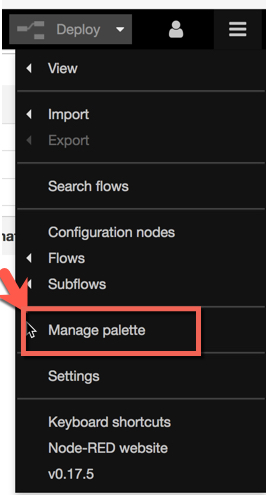
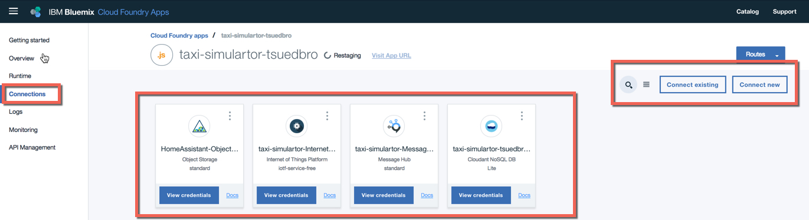

# Bluemix Hands-on Lab for IoT Creating a Taxi-Simulartor

In this Lab you will create a **Taxi-Simulartor** for IoT. This Taxi-Simulator will create sample data for a Data Analytics part, in one of the following Hands-on Labs.

**Functionality:**

1. The simulator will create different Taxi devices inside the Watson IoT Platform.
2. You can choose the count of the taxis you want create.
3. A created taxi will simulate speed and geolocation and the created data will be stored in a database.

**This Hands-on Lab Contains the steps to setup:**

* A simulator for Taxis, which do sending their speed and location information.
* Setup the IBM Watson IoT

**In the Hands-on Lab  you will use in IBM Bluemix:**

* The **Node-RED Starter** _Boiler Template_ with contains a **Cloudant DB** and a **Node.JS Server**.
* You will add additional nodes into the Node-RED instance [Node-RED Dashboard Node](https://flows.nodered.org/node/node-red-dashboard), [Node-RED Virtual IoT Device Node](https://www.npmjs.com/package/node-red-contrib-iot-virtual-device), [Node-RED Objectstore](http://flows.nodered.org/node/node-red-contrib-objectstore) and [Node-RED MessageHub](https://flows.nodered.org/node/node-red-contrib-messagehub)
* The [Watson IoT Service](https://console.bluemix.net/catalog/services/internet-of-things-platform?env_id=ibm%3Ayp%3Aus-south)
* The [Object Store Database](https://console.bluemix.net/catalog/services/Object-Storage?env_id=ibm%3Ayp%3Aus-south)
* The [Message Hub](https://console.bluemix.net/catalog/?context=services&app=bdd3e76c-09b7-47a6-8515-50c7e6b477e9&env_id=ibm%3Ayp%3Aeu-gb&search=Message%20Hub)

# 1 Setup the needed Application and services

In the part of the Lab you will setup and configure the environment, we will use for you Taxi-Simulartor.

### 1.1 Setup and configure Node-RED

1. Logon to your Bluemix Account and search in catalog for Node-RED. You will find the **Node-RED Boiler Template** and click on the icon.


2. Now you can see the which application and services will be create. Give the application and route a name like **taxi-simulartor-[YOUR-UNIQUE-NAME]**. Here you can find the **Cloudant DB** and the **Node.JS Server** and press **create**.


3. After this step select the **Visit App URL** to get to the Running Node-RED instance on the Node.JS Server.


4. Now just **follow the steps in the wizard** to do the basic configuration of the Node-RED instance.


5. Now inspect the landing page and press **Go to your Node-RED flow editor**.


6. Inside Node-RED we had to add the additional _Nodes_ we will use in our future flow. The [Node-RED Dashboard Package](https://flows.nodered.org/node/node-red-dashboard) and the [Node-RED Virtual IoT Device Package](https://www.npmjs.com/package/node-red-contrib-iot-virtual-device) . First select **manage palatte** from the menu on right upper side of the page.


7. Now choose the Tab **install** and search for each of these four nodes **node-red-dashboard**, **node-red-contrib-iot-virtual-device**, **node-red-contrib-objectstore**, **node-red-contrib-messagehub** and press install.


8. After the installation verify that following sections for the installed nodes will appear on the left hand side.


### 1.2 Create and bind the remaining needed Bluemix services

**Watson IoT and MessageHub**

1. Go back to your bluemix application and select on the left hand side **connections** and press **connect new**.


2. Search for the Watson IoT Service by insert in the catalog search **Internet of Things Platform** and press on the service.


3. For the service name insert following name **taxi-simulartor-InternetOfThingsPlatform** and press **create**. Do **NOT** select restage for now.


4. Repeat the steps 1 to 3 for the Service **MessageHub**

**Cloud object storage**

1. Now open the Bluemix catalog directly.


2. Search for the **Cloud Object Storage** directly in the catalog and select in this infrastructure component the **Bluemix Storage Swift**.


3. Name the service like this **taxi-simulator-ObjectStorage** and press create. _NOTE:_ You can only use **ONE** instance per **ORAGNIZATION** of **Cloud Object Storage**


4. Open your Bluemix Application in the Bluemix Dashboard and select **connections**.

5. Then select **connect existing** and search for your just created **Cloud Object Storage for Bluemix** service. If you are now ask to restage the application press **OK**.

6. Alter this steps have connected services look like in the following picture. In my case I have a different name for the **cloud object storage** service.


# 2 Configure the needed services and apply changes to the Node-RED flow

1. Copy the prepared Node-RED flow into the your Node-RED instance
2. Open the file **XXXXX** in GitHub and all select the the content into the clipboard
3. Inside Node-RED select **Menu->Import->Clipboard**

IoT
1. Create a new application token in IoT
2. Insert the application token into the IoT node inside the Node-RED flow


# 3 Basic Git Command line instructions

## 3.1 Git global setup

```
git config --global user.name "Thomas Südbröcker"
git config --global user.email "thomas.suedbroecker.2@de.ibm.com"
```
## 3.2 Create a new repository

```
git clone git@git.ng.bluemix.net:thomas.suedbroecker.2/Bluemix-Hands-on-Workshop-IoT.git
cd Bluemix-Hands-on-Workshop-IoT
touch README.md
git add README.md
git commit -m "add README"
git push -u origin master
```

## 3.3 Existing folder

```
cd existing_folder
git init
git remote add origin git@git.ng.bluemix.net:thomas.suedbroecker.2/Bluemix-Hands-on-Workshop-IoT.git
git add .
git commit -m "Initial commit"
git push -u origin master
```

## Existing Git repository

```
cd existing_repo
git remote add origin git@git.ng.bluemix.net:thomas.suedbroecker.2/Bluemix-Hands-on-Workshop-IoT.git
git push -u origin --all
git push -u origin --tags
```
